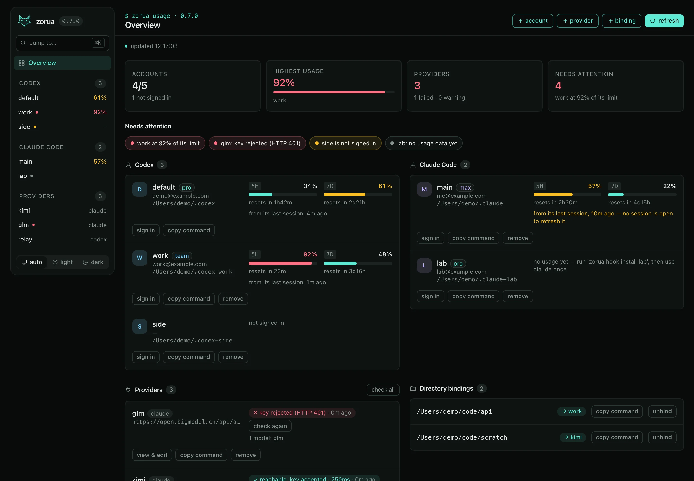

<p align="center">
  
</p>

<h1 align="center">Zorua</h1>

<p align="center">
  <b>Run several Codex and Claude Code accounts side by side — one per terminal.</b><br>
  zsh · bash · fish
</p>

Zorua keeps your AI coding agents' accounts apart. Every account lives in its own
directory (`CODEX_HOME` for the OpenAI Codex CLI, `CLAUDE_CONFIG_DIR` for Claude Code),
so each has its own sign-in, sessions, settings and usage quota. A shell picks one
account per terminal: no restart, no global "active account" that flips every other
window. Repositories can be bound to the account that owns them and switch
automatically on `cd`, and one command shows plan and usage for all accounts.

```text
$ zorua usage
 Codex
   NAME     PLAN    5H           7D           RESET
 ● default  pro     –            ▓░░░░░   6%  4d9h
   work     promax  –            ░░░░░░   0%  7d
   side     team    ░░░░░░   0%  ▓▓░░░░  26%  1d15h

 Claude Code
   NAME  PLAN  5H           7D           RESET
   alt   max   ▓▓▓░░░  42%  ▓░░░░░   7%  4d9h

 ● this shell  ◆ auto-bound directory
 alt: Claude usage as of 3m ago (from its last session)
```

## What it does

- **Parallel accounts.** The selection is an environment variable, so four panes can
  run four different sign-ins at the same time — Codex and Claude Code mixed.
- **One list for both agents.** Accounts of both tools are listed in their own
  sections with email and plan; names are unique across tools,
  so `zorua work` always means one account.
- **Usage at a glance.** `zorua usage` draws the 5-hour and weekly windows of every
  account; `-v` adds the home directory, longer bars and credits.
- **Project bindings.** `zorua bind work` in a repository and it switches to that
  account whenever you `cd` in, and back when you leave.
- **One-shot runs.** `zorua work exec "…"` or `zorua alt -p "…"` runs the right agent
  under an account without touching your shell.
- **First-run wizard.** `zorua setup` adopts existing Codex homes, signs accounts in,
  adds new ones and binds the current directory.
- **Providers for both agents.** Third-party Claude Code and Codex endpoints (GLM, Kimi,
  DeepSeek, a relay) are picked per terminal too, one slot per agent, and can be imported
  from cc-switch. See [Providers](#providers-third-party-claude-code-and-codex-endpoints).
- **No moving parts.** One small Python program (standard library only) plus a thin
  layer per shell: no daemon, no proxy, nothing wrapped around `codex` or `claude`.

## Install

Requires zsh 5.3+, bash 3.2+ or fish 3+ (any of them; the macOS defaults are fine),
`python3` 3.8+, and the agent CLIs you want to use ([Codex CLI](https://developers.openai.com/codex)
and/or [Claude Code](https://code.claude.com)) on `PATH`.

```shell
curl -fsSL https://raw.githubusercontent.com/szupzj18/zorua/main/install.sh | sh
```

or from a clone: `git clone https://github.com/szupzj18/zorua.git && cd zorua && sh install.sh`.
Open a new terminal and run `zorua setup` (or `zorua help`).

The installer copies the program to `~/.zorua` and adds one `source` block for each
shell it finds: `~/.zshrc`, `~/.bashrc` and `~/.config/fish/conf.d/zorua.fish`.
Pin a release with `ZORUA_REF`, for example `… | ZORUA_REF=v0.7.1 sh`. Every
[release](https://github.com/szupzj18/zorua/releases) also ships a tarball
(`zorua-<version>.tar.gz`) and a `SHA256SUMS` file.

## Quick start

```shell
zorua setup                          # interactive first-run wizard

# Codex accounts
zorua add work                       # creates ~/.codex-work and runs codex login
zorua add side --device-auth         # headless sign-in
zorua add client --home ~/homes/acme --no-login     # register an existing directory

# Claude Code accounts (subscription logins)
zorua add --claude alt               # creates ~/.claude-alt and runs claude auth login

zorua                                # list accounts: email, plan
zorua usage                          # + 5h / 7d usage bars
zorua use work                       # this shell now runs Codex as "work"
zorua use alt                        # ...and Claude Code as "alt" (both can be active)
zorua use -                          # back to the defaults
zorua work exec "explain this repo"  # one-shot, shell unchanged
zorua alt -p "hello"                 # one-shot for a Claude Code account
```

`zorua use` only affects the current shell: open another terminal and `zorua use side`
there, and both run at the same time on different accounts. Because the selection is just
an environment variable, tmux or Herdr panes are independent as well; a 2×2 grid with four
accounts signed in works naturally.

## How accounts are kept apart

| | Codex CLI | Claude Code |
|---|---|---|
| Account directory | `~/.codex-<name>` | `~/.claude-<name>` |
| Selected through | `CODEX_HOME` | `CLAUDE_CONFIG_DIR` |
| Sign-in | `codex login` | `claude auth login` (claude.ai subscription) |
| Plan and email | decoded locally from the login token | `claude auth status` |
| 5h / 7d usage | live, queried with the account's own token | cached from Claude Code's status line (below) |

The default Codex account is `~/.codex`. Zorua does not modify the contents of an account
directory, with one opt-in exception: `zorua hook` edits a Claude account's status-line
setting and the relay writes its usage cache there.

Good to know when using Claude Code accounts:

- Some variables outrank a subscription login: `ANTHROPIC_AUTH_TOKEN`,
  `ANTHROPIC_API_KEY`, `CLAUDE_CODE_OAUTH_TOKEN` and `CLAUDE_CODE_USE_*`; a set
  `ANTHROPIC_BASE_URL` redirects requests (to a local proxy, say). `zorua use` warns when
  any of them is present. The one-shot form `zorua alt …` removes them for that run
  and, if `ANTHROPIC_BASE_URL` was set, pins it to `https://api.anthropic.com`.
- Only subscription (claude.ai) logins are isolated per directory. A Console sign-in
  without an API key is stored outside the config directory and is shared. Third-party
  providers and API keys are not managed.
- On macOS the Keychain entry of a Claude account is named after the exact path of its
  directory, so a trailing `/` would address a different entry. `zorua add` stores an
  absolute path without one.

## Usage windows

`zorua usage` queries Codex accounts live (each with its own token, against the same
usage endpoint Codex uses). Claude Code publishes no usage API, but it passes the 5-hour
and weekly windows (`rate_limits`, claude.ai Pro and Max) to the account's *status-line*
command. `zorua hook install alt` wraps that command in a small relay that saves the two
windows to `<config dir>/.zorua-usage.json` and then runs your original command
unchanged; `zorua usage` shows the cached values together with their age. A window whose reset time
has passed is no longer shown as a percentage (it has reset and the new usage is unknown):
`zorua usage` says so, and `--json` lists it under `usage.expired`. The relay reads no credentials and makes no
network calls. Data exists after the account has been used once with the relay installed.

```shell
zorua hook install alt --dry-run     # preview exactly what changes
zorua hook install alt               # writes settings.json (a backup is made first)
zorua hook status                    # which Claude accounts use the relay, cache age
zorua hook remove alt                # restores the original command (--all for every account)
zorua hook install alt --shadows     # also wrap a status line that hides the relay (see below)
```

- **A status line in project settings hides the relay.** Claude Code gives
  `<dir>/.claude/settings.json` (and `settings.local.json`) priority over the account's own
  `settings.json` for sessions started in `<dir>`. If such a file defines a status line, those
  sessions never run the relay and the account shows no usage. `zorua hook status`, `zorua usage`
  and the dashboard report it (`SHADOWED`); `zorua hook install alt --shadows` wraps that status
  line too (a backup is made, `--dry-run` previews) and `hook remove alt --shadows` undoes it.
  Zorua looks in `$HOME`, the current directory and the directories bound to the account.

- An account **without** a status line gets a minimal one (model, context, 5h/7d). Claude
  Code hides most footer keyboard hints while any status line is configured, so
  `install` asks for confirmation (or `--yes`) and `remove` deletes the line again.
- The command keeps working when settings are shared between machines (the script path
  uses `$HOME`) and falls back to your original command if the relay or `python3` is
  missing, so a status line never breaks.
- `sh uninstall.sh --purge` restores all status lines automatically.

## Project bindings

Bind a repository to the account that owns it. Entering the directory (or any
subdirectory) switches automatically; leaving restores what you had before:

```shell
cd ~/code/company-api
zorua bind work                   # Codex account; a Claude account can be bound the same way
cd ~                              # restored automatically
cd ~/code/company-api             # switches again; the prompt shows [codex:work:auto]

zorua binds                       # list bindings
zorua unbind                      # remove the binding for the current directory
```

A manual `zorua use` inside a bound directory wins until you leave it. Bindings match by
longest directory prefix, so nested projects can differ from their parent, and a
directory can bind one Codex and one Claude Code account at once.

## Providers (third-party Claude Code and Codex endpoints)

A provider is a base URL, an API key and a model (or a model mapping, for Claude Code), for
a service that speaks the agent's API: GLM, Kimi, DeepSeek, a company relay, … Providers are
picked per terminal, like accounts, and **each agent has its own provider slot**: one shell
can run Claude Code on `kimi` and Codex on `deepseek` at the same time.

```zsh
# Claude Code (Anthropic-compatible endpoint); key is prompted (hidden) if --key is omitted
zorua provider add kimi --base-url https://api.moonshot.cn/anthropic --model default=kimi-k2
# Codex (Responses-compatible endpoint); --model is required
zorua provider add deepseek --codex --base-url https://api.deepseek.com --model deepseek-v4-flash

zorua use kimi             # plain `claude` in this terminal now runs on kimi
zorua use deepseek         # ...and plain `codex` on deepseek (both slots active)
zorua deepseek exec "…"    # one-shot: run codex on provider deepseek
zorua bind deepseek        # this directory switches to deepseek automatically
zorua provider import cc-switch --dry-run     # preview copying providers out of cc-switch
```

### Many models per provider

A relay often serves a dozen models. A provider keeps a catalog of them, and each terminal
picks one:

```zsh
zorua provider models relay fetch              # ask the endpoint (GET /v1/models) for its list
zorua provider models relay add vendor/some-model nice   # or add one by hand, with an alias
zorua use relay:es1                            # switch provider and model together
zorua model                                    # list the active provider's models (● = picked)
zorua model seed                               # pick another one; alias, full id or a unique prefix
zorua model -                                  # back to the provider's own default
zorua relay:es1 -p "hi"                        # one-shot on a given model
```

The pick lives in `ZORUA_CLAUDE_MODEL` / `ZORUA_CODEX_MODEL` of that terminal and is dropped
when you switch to another provider. It replaces the main model only: Claude Code gets it as
`ANTHROPIC_MODEL`, Codex as the `-c model=…` override. The Opus/Sonnet/Haiku mapping of a
Claude provider stays as configured. Aliases are made from the id (`model_hub/es1_orange_o50[1M]`
becomes `es1_orange_o50`); the full id, including suffixes such as `[1M]`, is what is sent.
`provider add` and `provider import cc-switch` seed the catalog from the models they already know.

### How it works

While a provider is active, Zorua's `claude` / `codex` shell function starts
the agent with the provider applied, and passes straight through when none is active.

| | Claude Code | Codex |
|---|---|---|
| Applied through | `claude --settings <file>` | `codex -c model_provider=… -c model_providers.…=… -c model=…` |
| Key travels in | the settings file (mode 0600, `~/.config/zorua/run/`) | the `ZORUA_CODEX_KEY` environment variable (`env_key`) |
| Why not plain env vars | `ANTHROPIC_BASE_URL` in the shell loses to the `env` block of `settings.json`; `--settings` outranks it | not needed: `-c` outranks `config.toml` |
| Nothing else touched | `~/.claude/settings.json` is never written | `config.toml` is never written |

The key never appears in `ps` for either agent. For Claude Code, variables that
`settings.json` sets and the provider does not (`ANTHROPIC_*`, `CLAUDE_CODE_SUBAGENT_MODEL`, …)
are blanked, so a relay's model names do not leak into another provider.

- Only provider settings are overridden. Skills, plugins, MCP servers, hooks, permissions,
  `CLAUDE.md` / `AGENTS.md`, reasoning effort and every other setting keep working as they
  do without a provider (checked against the real `claude` and `codex`). Unrelated
  variables in `settings.json`, such as `CLAUDE_CODE_MAX_OUTPUT_TOKENS`, stay as you set them,
  so a limit tuned for one relay still applies on another provider; override it with `--env`.
- Claude: `--api-key` sends the key as `ANTHROPIC_API_KEY` (default `ANTHROPIC_AUTH_TOKEN`);
  `--model ROLE=ID` with ROLE in `default`, `opus`, `sonnet`, `haiku`, `subagent`;
  `--env VAR=VALUE` adds any other variable.
- Codex: `--model ID` (exactly one), `--wire-api` (default `responses`).
- Both: `--key-env VAR` reads the key from a variable; `--force` replaces a provider. A name
  belongs to one agent and is unique across accounts and providers.
- Only the `claude` / `codex` you type in that shell is affected. Scripts and tools that launch
  the agent themselves do not go through the function; use `zorua <provider> …` for those.
- `provider import cc-switch` reads cc-switch's database read-only and copies the custom
  Claude and Codex providers that carry their own key. Entries that point at cc-switch's local
  proxy, and official logins, are skipped.
- Not included: a local proxy, failover and per-request cost tracking.

## Commands

| Command | What it does |
|---|---|
| `zorua` / `zorua ls` | List accounts: email and plan (`-v`: home directory; `--expiry`: Codex subscription end date) |
| `zorua usage` | The same with live 5h / 7d usage bars |
| `zorua usage -v` / `zorua ls -v` | Detailed blocks per account (home, bars, credits) |
| `zorua setup` | Interactive first-run wizard |
| `zorua add <name>` | Create a Codex account (new `CODEX_HOME`, sign-in) |
| `zorua add --claude <name>` | Create a Claude Code account (new `CLAUDE_CONFIG_DIR`, sign-in; seeded from `claude-settings.json` if present) |
| `zorua add … --home DIR` | Register an existing directory instead |
| `zorua add … --no-login` / `--device-auth` | Skip sign-in / headless sign-in (Codex) |
| `zorua login <name>` | (Re)run the sign-in of one account |
| `zorua use <name>` / `zorua use -` / `zorua off` | Switch this shell to an account / back to defaults |
| `zorua off providers` | Clear only the providers of this shell, keep the accounts |
| `zorua <name> [args…]` | One-shot: run `codex` or `claude` under that account |
| `zorua bind [name]` / `unbind [dir]` / `binds` | Manage directory bindings |
| `zorua provider add\|ls\|show\|rm\|import` | Manage third-party Claude Code and Codex providers (see above) |
| `zorua provider get <name> [--reveal]` / `put <name>` | One provider as JSON (keys masked unless `--reveal`) / replace it from JSON on stdin; `put` keeps `providers.json.bak`. The web dashboard edits providers through these |
| `zorua provider check <name> [--json]` | Is the endpoint reachable and the key accepted? `GET` the model list (free); an Anthropic endpoint without one gets a one-token message request. Prints ok / warn / fail with the HTTP status and latency; never prints the key. The web dashboard's **check** buttons run it |
| `zorua use <provider>[:<model>]` / `zorua <provider>[:<model>] [args…]` | Switch this shell to a provider (and a model of it) / one-shot run |
| `zorua model [alias\|-]` | List / pick / clear the model of the active provider |
| `zorua provider models <name> [add\|rm\|fetch]` | Manage a provider's model catalog |
| `zorua rm <name> [--purge]` | Unregister an account (data kept unless `--purge` or confirmed) |
| `zorua hook install\|remove\|status\|refresh` | Claude usage relay (see above) |
| `zorua prompt` | Print the prompt marker |
| `zorua version` / `zorua help` | Version / help |

## Shells and the prompt

| | zsh | bash | fish |
|---|---|---|---|
| Commands, `use`, one-shot | yes | yes | yes |
| Auto-switch on `cd` | `chpwd` hook | `PROMPT_COMMAND` | `--on-variable PWD` |
| Tab completion (commands, account names) | yes | yes | yes |
| Prompt marker | right prompt, automatic | `$ZORUA_PROMPT_TEXT` | `$ZORUA_PROMPT_TEXT` |

The marker shows the active accounts — `[codex:work]`, `[claude:alt]`,
`[codex:work claude:alt]`, with `:auto` for directory bindings. For bash:
`PS1='$ZORUA_PROMPT_TEXT \u@\h:\w\$ '`; for fish:
`function fish_right_prompt; echo $ZORUA_PROMPT_TEXT; end`.

How it works: the `zorua` shell function runs `zorua_core.py`, which does all the work and
writes any environment change it needs (`CODEX_HOME`, `CLAUDE_CONFIG_DIR`, binding state,
prompt marker) to a temporary file that the wrapper then sources. One implementation
serves every shell.

## Web dashboard (optional)

[](https://szupzj18.github.io/zorua/demo/)

**[Try it live](https://szupzj18.github.io/zorua/demo/)**: the real dashboard running in your browser on made-up data (nothing leaves the page).

`web/` holds a small local dashboard (Next.js + Tailwind CSS) for accounts, 5h/7d usage, providers and directory bindings, with add/remove/sign-in and a provider editor (env variables, key, model catalog; copy a key without showing it). Dark by default, light follows the system. It reads `zorua usage --json`, listens on `127.0.0.1:4747` only and runs the matching `zorua` commands for changes. See [web/README.md](web/README.md).

## Files and configuration

```text
~/.zorua/                              the program: zorua_core.py, zorua_providers.py, zorua_statusline.py, zorua.{zsh,bash,fish}
~/.config/zorua/accounts.tsv           Codex accounts       <name>\t<CODEX_HOME>
~/.config/zorua/claude-accounts.tsv    Claude Code accounts <name>\t<CLAUDE_CONFIG_DIR>
~/.config/zorua/claude-settings.json   optional template copied to a new Claude account's settings.json (e.g. proxy env); never overwrites
~/.config/zorua/bindings.tsv           directory bindings   <name>\t<path>
~/.config/zorua/providers.json         Claude Code and Codex providers incl. API keys (mode 0600); run/<name>.settings.json is generated
~/.codex  ~/.codex-<name>/             Codex homes     (untouched)
~/.claude-<name>/                      Claude Code config directories
```

| Variable | Effect |
|---|---|
| `ZORUA_CONFIG_DIR` | Where the registry files live |
| `ZORUA_HOME` / `ZORUA_REF` | Installer: install directory / release tag to install |
| `NO_COLOR` / `ZORUA_COLOR=always` | Disable / force colors (colors only appear on a terminal) |
| `ZORUA_EXPIRY` | `1` shows the Codex subscription end date (same as `--expiry`); hidden by default because it is read from a cached token and can be stale |
| `ZORUA_CLAUDE_PROVIDER` / `ZORUA_CODEX_PROVIDER` | Set by Zorua: the active provider of each agent |
| `ZORUA_PROMPT_TEXT` | Set by Zorua: the prompt marker text |

On first run `default` (`~/.codex`) is seeded and existing `~/.codex-*` directories that
already hold an `auth.json` are registered.

## Privacy

Emails, plans and (on request) expiry dates are decoded locally from the login tokens or taken from
`claude auth status`; no token is ever printed. The only network access Zorua itself makes
while running is `zorua usage` sending each Codex account's own token to OpenAI's usage
endpoint. The Codex desktop app
and the VS Code extensions do not read `CODEX_HOME` / `CLAUDE_CONFIG_DIR`; Zorua manages the
command-line tools.

## For AI agents

An agent-readable summary (commands, non-interactive usage, files, caveats) is served at
<https://szupzj18.github.io/zorua/llms.txt>.

## Why "Zorua"?

Zorua is the illusion fox of the Pokémon games: it takes on the appearance of other
creatures, so what you see is not always what is really there. That is the trick this
tool plays on your terminals. One machine, one login session — and every window shows up
as a different account: work in one pane, personal in the next, a client's team plan in
a third, each with its own sign-in, history and quota, none of them aware of the others.
The icon is an original drawing (a fox with a ghost afterimage of itself), not Pokémon
artwork; the name is only a nod.

## Upgrading, uninstalling

Run the installer again to upgrade. Zorua was called *CodeX Switch* (`codex-switch`,
command `cx`) before 0.5.0; the installer migrates such an install: it replaces the old
`# >>> codex-switch >>>` block in `~/.zshrc`, `~/.bashrc` and fish's `conf.d`, copies the
registry from `~/.config/codex-switch` (the old files stay as a backup), removes the old
`cx_*.py` files and rewrites Claude status-line relays to the new script. Afterwards you
may delete `~/.codex-switch` and `~/.config/codex-switch`. Two things to adjust yourself:
the command is now `zorua` (add `alias cx=zorua` if you like the short form), and the
environment variables moved from `CX_*` to `ZORUA_*` (`CX_CONFIG_DIR`, `CX_HOME` and
`CX_COLOR` are still honoured).

```shell
sh uninstall.sh            # remove the rc source blocks
sh uninstall.sh --purge    # also restore Claude status lines and remove ~/.zorua
```

Account directories and `~/.config/zorua` are kept; delete them yourself if you want.

## Development

```shell
zsh tests/smoke.zsh             # per-shell checks in an isolated temp HOME, no network
bash tests/smoke.bash
fish tests/smoke.fish
zsh tests/install-e2e.zsh       # full install journey (run as root in a bare container)
```

The install E2E creates a fresh unprivileged user, installs, exercises the commands in real
interactive zsh, bash and fish shells (with fake `codex` and `claude` binaries), checks the
message shown without python3, an upgrade from an old install, and that `uninstall.sh`
leaves account data intact. Locally, in a throwaway container:

```shell
docker run --rm -v "$PWD":/src:ro -w /src ubuntu:24.04 bash -c \
  "apt-get update -qq && apt-get install -y -qq zsh fish python3 && zsh tests/install-e2e.zsh"
```

CI (`.github/workflows/smoke.yml`) runs every suite on each push and pull request (Python
3.8 and 3.12).

**Releasing.** Pushing a tag publishes a release through `.github/workflows/release.yml`:
bump `VERSION` in `zorua_core.py` and merge it, then `git tag v0.7.1 && git push origin v0.7.1`
(a suffix such as `-rc1` makes it a pre-release). The workflow runs the full test suite,
fails if the tag does not match `VERSION`, builds the tarball and `SHA256SUMS`, checks that
the tarball installs and reports the right version, and creates the GitHub Release with
generated notes.

## License

[MIT](LICENSE)

---

Zorua is an independent project. The name is a nod to the Pokémon of the same name (an
illusion fox that takes on other forms); it is not affiliated with or endorsed by
Nintendo, Game Freak, Creatures or The Pokémon Company. Codex is a product of OpenAI and
Claude Code of Anthropic; this tool is not affiliated with either.
